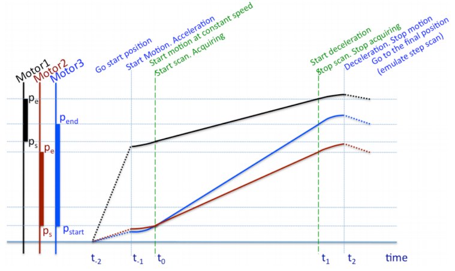

	Title: Continuous Scan Implementation
	SEP: 6
	State: CANDIDATE
	Date: 2013-07-29
	Drivers: Zbigniew Reszela <zreszela@cells.es>
	URL: http://www.sardana-controls.org/sep/?SEP6.md
	License: http://www.jclark.com/xml/copying.txt
	Abstract:
	 Generic Scan Framework requires extension for a new type of scans: continuous scans.
	 Various types of synchronization between moveable and acquisition elements exists:
	 software (so called best effort) and hardware (either position or time driven).
	 The challenge of this SEP is to achieve the maximum generalization and transparency 
	 level between all types of continuous scans (and probably step scans as well). This 
	 design and implementation will require enhancement of the already existing elements of 
	 Sardana: controllers, moveables, experimental channels and measurement group and 
	 probably definition of new elements e.g. triggers. A proof of concept work was already 
	 done at ALBA, and it could be used as a base for the further design and development.

Current situation
=================
In the present situation, step scans can be executed using the software synchronization mode. The software-synchronized continuous scans are already implemented in Sardana as well and are described [here](http://sardana-controls.org/users/scan.html#continuous-scans). A reduced API abstracts some specifics of the totally hardware-synchronized systems, however requires some generalization. 

A set of scan macros with the "ct" suffix allow to execute continuous scans. The Experimental Channel *pseudo-API* is based on the following extra attributes: "NrOfTriggers", "AcquisitionTime", "TriggerMode" and "Data". Control over start and stop of the experimental channels is achieved via "SendToCtrl" method of the controllers. The following string arguments should be understandable by the controller: "pre-start <axis\>", "start <axis\>", "pre-stop <axis\>", "stop <axis\>". Configuration of the hardware-triggering objects is done via "TriggerDevice" environment variable. It accepts a list of the Tango device names, where the first one is the master trigger. The *pseudo-API* of the triggering-object is based on the following attributes: InitialDelayTime, HighTime, LowTime (all in seconds), SampPerChan (used to configure number of triggers) and IdleState (Low or High). This interface is also based on two commands: "Start" and "Stop". Current implementation extracts the acquired data at the end of the scan.

A proof of concept of the "online data visualization and storage" was implemented in the "ASCANCT" branch of the former Sardana svn repository, what later was renamed to the "sep6" branch in the current git repository. Previously required be the Experimental Channel *pseudo-API* "AcquisitionTime" attribute was replaced by the "IntegrationTime" attribute of the Measurement Group. Its value gets passed to the controller via a sequence of Load\[One,All\] calls. "TriggerMode" attribute was substituted by the Measurement Group configuration parameter "Trigger". Calls to the "SendToCtrl" method were substituted by calls to the \[Pre\]Start\[One,All\] controller methods. During scan execution, poolacquisition action extracts the already available data (using sequence of \[Pre\]Read\[One,All\] calls) and pushes Tango CHANGE_EVENTs of "Data" attributes. The Measurement Group representative on the Macroserver side is subscribed to these events. The callback execution feeds this data to the DataHandler, which decides if a complete record is ready. If so, it gets passed to the registered recorders.

Both of this approaches supports the following hook places: "pre-scan", "pre-configuration", "post-configuration", "pre-start", "pre-cleanup" and "post-cleanup"

Specification
==========

Contents
-------------

- Transparency
- Generic Scan Framework
- Measurement Group
- Controller
- Trigger/Gate
- Experimental Channel
- Data collection, merging and storage
- Data transfer
- Motion
- Activity diagram
- Example of usage
- Implementation status

Transparency
-------------------

Sardana scans can be executed in the following modes: step, continuous and hybrid. The main difference between them is how the motion and the acquisition phases are executed. The step scans execute motion and acquisition sequentially, accelerating and decelerating the moveables in between each scan point. The acquisition phase is executed while the moveables are stopped. The continuous scans execute all the acquisitions simultanously to the motion of the moveables from the scan start to the end positions. Acquisitions are synchronized to be executed on the scan intervals commanded by the user. In the hybrid scans motion to each scan point is acompanied with the acquisition from the previous scan point, so the acquisition is also executed while moveables are moving, however they stop in between each scan point.

A step scan can be executed with one of the standard macros e.g. ascan, d2scan, mesh. While the continuous scans developed in this SEP can be executed with their equivalents terminated with *ct* suffix. Parameters of the continuous scans are the same as in the step scans. Also the scan records comprise the same fields as in the step scan. The only difference in the continuous scan records is that the: motor positions and the delta times are filled with the nominal values instead of the real ones. The measurement group configuration should allow to scan in step and continuous modes without the need to reconfigure any parameters, of course if the hardware allows that. For the reference a different type of the continuous scans, terminated with *c* suffix, is also present in Sardana.

Example of a continuous scan - the absolute equidistant continuous scan:

    ascanct <motor> <start_pos> <final_pos> <nr_interv> <integ_time>

Generic Scan Framework (GSF)
------------------------------------

GSF and its components have basically 3 roles:

* It uses the input parameters of the scan together with the already present configuration of the involved in the scan elements and transforms it into more specific parameters. These parameters are set to the involved elements in the process of preparation to scanning: e.g. move motors to the correct positions, set synchronization specification to the Measurement Group
* Control the scan flow e.g. starts in the correct sequence the involved elements
* Receive the data chunks, compose the scan records and perform the interpolation if necessary, finally passing all the data to the recorders.

User inputs:

* moveable(s)
* start position(s)
* end position(s)
* number of intervals
* integration time
* latency time (optional) - It may be especially useful for acquisitions involving the software synchronized channels. The software overhead may cause acquisitions to be skipped if the previous acquisition is still in progress while the new synchronization event arrives. The *latency time* parameter, by default, has zero value.

Other inputs:

* acceleration times(s), deceleration time(s) and base rate(s) obtained from the Motor(s)
* latency time obtained from the MeasurementGroup

Calculation outputs:

* pre-start and post-end position(s)
* common acceleration and deceleration time
* velocitie(s)
* master (reference) moveable
* synchronization specification

Formulas:

* pre-start, post-end positions, acceleration, deceleration and velocity - see Motion chapter
* Synchronization structure (this example describes an equidistant scan of a single physical motor):
* The maximum of the user input latency time and the active measurement group latency time is used.

Parameter | Time | Position
---------- | ---------- | ------ 
Offset | acceleration time | velocity * acceleration time / 2
Initial | None | start position
Active | integration time | integration time * velocity
Total | velcity / scan intervals | end - start / number of intervals

Repeats = number of intervals + 1

Measurement Group (MG)
-----------------------------
MeasurementGroup is a group element. It aggregates other elements of types ExpChannel (these are CounterTimer, 0D, 1D and 2D ExperimentalChannels) and TriggerGate. The MeasurementGroup's role is to execute acquisitions using the aggregated elements.

The acquisition is synchronized by the TriggerGate elements or by the software synchronizer. The hardware synchronized ExpChannel controllers  are configured with the number of acquisitions to be executed while the software synchronized do not know a priori the number of acqusitions.

Latency time is a new attribute of the measurement group which role is to introduce an extra latency time in between two consecutive acquisitions. Its value corresponds to the maximum latency time of all the ExpChannel controllers present in the measurement group. It may be especially useful for acquisitions involving software synchronized channels. The software overhead may cause acquisitions to be skipped if the previous acquisition is still in progress while the new synchronization event arrives. The *latency time* parameter, by default, has zero value.

On the MeasurementGroup creation, the software synchronizer is assigned by default to the newly added ExperimentalChannel controllers, hence the MeasurementGroup could start measuring without any additional configurations. 

The configuration parameters:

- **Configuration** (type: dictionary) - stores static configuration e.g. which synchronizer is associated to which ExperimentalChannel controller and which synchronization type is used (Trigger or Gate)
- **Synchronization** (type: list of dictionaries) - express the measurement synchronization, it is composed from the groups of equidistant acquisitions described by: the initial point and delay, total and active intervals and the number of repetitions, these information can be expressed in different synchronization domains if necessary (time, position, monitor) 
- **LatencyTime** (type: float, unit: seconds, access: read only): latency time between two consecutive acquisitions
- **Moveable** (type: string) - full name of the master moveable element
- **Monitor** (type: string) - full name of the monitor channel element - TODO: elaborate it

Format of the configuration parameter:

~~~~
dict <str, obj=""> with (at least) keys:
      - 'timer' : the MG master timer channel name / id
      - 'monitor' : the MG master monitor channel name / id
      - 'controllers' : dict <Controller, dict=""> with one entry per controller:
          - ctrl_object : dict<str, dict=""> with (at least) keys:
              - 'timer' : the timer channel name / id
              - 'monitor' : the monitor channel name / id
              - 'synchronization' : 'Trigger' / 'Gate'
              - 'synchronizer': the TriggerGate name / id or 'software' to indicate software synchronizer
              - 'channels' where value is a dict<str, obj=""> with (at least) keys:
                      - ...
~~~~

The configuration parameter had change during the SEP6 developments. First of all the [feature request #372](https://sourceforge.net/p/sardana/tickets/372/) was developed and the units level disappeared from the configuration. Furthermore the controller parameters _trigger_type_ was renamed to _synchroniation_. In both cases one-way backwards compatibility was maintained. That means that the measurement groups created with the previous versions of Sardana are functional. Once their configuration gets saved again (either after modification or simply by re-applying), the configuration is no more reverse compatible. **IMPORTANT: when deploying the SEP6 consider back-up of the measurement groups configurations in case you would need to rollback**

Format of the synchronization parameter:

~~~~
list of dicts <SynchParam, obj> with the following keys:
      - SynchParam.Delay : dict <SynchDomain, float> initial delay (relative to start) expressed in Time and Position* domain
      - SynchParam.Initial : dict <SynchDomain, float> initial point (absolute) expressed in Time and Position* domain
      - SynchParam.Active : dict <SynchDomain, float> active interval (with sign indicating direction) expressed in Time (and Position domain) or Monitor domain
      - SynchParam.Total': dict <SynchDomain, float> total interval (with sign indicating direction) expressed in Time and Position* domain
      - SynchParam.Repeats: <long> - how many times the group has to be repeated
* Position domain is optional - lack of it implicitly forces synchronization in the Time domain e.g. timescan
~~~~

TODO: decide what to do with the following configuration parameters (together with their corresponding Tango attributes and commands). Do we need a backwards compatibility layer for them? All of them are redundant with the information present in the Synchronization parameter.

- **integration_time** (type: float, units: seconds) - integration time of each acquisition
- **monitor_count** (type: long) - monitor count of each acquisition
- **acquisition_mode** (type: string) - wheter timer or monitor acquisition
- **StartMultiple** - execute multiple acquisitions

Parameters validation is out of the SEP6 scope.

Trigger/Gate
----------------

TriggerGate is a new Sardana element type and it represents devices with trigger and/or gate generation capabilities. Their main role is to synchronize acquisition of the ExpChannel. Trigger or gate characteristics could be described in either of three configuration domains: time, position or monitor (TODO: elaborate monitor domain). In the time domain, elements are configured in time units (seconds) and generation of the synchronization signals is based on passing time. The concept of position domain is based on the relation between the TriggerGate and the Moveable element. In the position domain, elements are configured in distance units of the Moveable element configured as the feedback source (this could be mm, mrad, degrees, etc.). In this case generation of the synchronization signals is based on receiving updates from the source.

Each ExpChannel controller can have one TriggerGate element associated to it. Its role is to control at which moment each single measurement has to start in case of trigger or start and stop in case of gate.

The configuration parameters:

- **active_domain** (type: enumeration, options: *time*, *position* or *default*) - which of the domains to use from the configuration to generate active events. *default* means: first try to use position and only if not available, time should be used. When the selected domain is missing in the configuration an exception should be raised.
- **passive_domain** (type: enumeration, options: *time*, *position* or *default*) - which of the domains to use from the configuration to generate passive events. *default* means: first try to use time and only if not available, time should be used. When the selected domain is missing in the configuration an exception should be raised.

The configuration parameters out of the SEP6 scope:

- **sign** (type: long, options: -1 or 1) - wheter to invert the positions updates or not 
- **factor** (type: float) - translation factor from hardware to user units
- **offset** (type: float) - offset from the hardware to user units
- **idle_state** (type: enumeration, options: low|high) - state maintained during the offset interval 

The allowed states for TriggerGate element are:

- On - the element is ready to generate synchronization signals
- Moving - the element is currently generating synchronization signals
- Fault - the device is faulty

**Tango interface**

Each TriggerGate element is represented in the Tango world by one device of TriggerGate Tango class. They implement State and Status Tango attributes.

**TriggerGate controller (plug-in)**

A custom TriggerGate controller must inherit from the TriggerGateController class. The controller class must define the supported domains: time and/or position. The dynamic configuration is accessed via the SetConfiguration and GetConfiguration methods. This configuration has the same format as the MeasurementGroup Synchronization parameter. The static parameters e.g. offset, sign or factor are implemented as axis parameters (see analogy to step_per_unit of the MotorController).

TriggerGateController API (**bold** are mandatory):

- AddDevice
- DeleteDevice
- PreStateAll
- PreStateOne
- StateAll
- **StateOne**
- PreSartOne
- PreStartAll
- **StartOne**
- StartAll
- StopOne
- StopAll
- **AbortOne**
- AbortAll
- **SetConfiguration** and **GetConfiguration** (see format of MG Synchronization parameter)
- SetAxisPar and GetAxisPar

Sardana provides one TriggerGate controllers DummyTriggerGateController which does not synchronize acquisition and just provides dummy behavior. DummyTriggerGateController imitate the behavior of the hardware with trigger and/or gate signal generation capabilities. It emulates the state machine: changes state from On to Moving on start and from Moving to On based on the configuration parameters or when stopped.

Software synchronizer resides in the core of Sardana and generates software events of type: TGEventType.Active and TGEventType.Passive. The acquisition action listens to these events and start or start and stop the acquisition process when they arrive.
In case the MeasurementGroup Synchronization contains position domain characteristics this controller is added as a listener to the to the moveable's position attribute. Then the generation of generates the synchronization events is based on these updates.

**Pool Synchronization action**

PoolSynchronization is the Pool's action in charge of the control of the TriggerGate elements during the generation, which usually take place in the MeasurementGroup acquisition process.

Its **start_action** method executes the following:

- load dynamic configuration to the hardware by calling SetConfiguration
- in case the software synchronizer is in use, add the acquisition action as a listener of the SoftwareTriggerGateController
- in case the position domain synchronization is in use it adds the SoftwareTriggerGateController as a listenr of the moveable's position updates
- start the involved axes
    - for each controller implied in the generation call PreStartAll
    - for each axis implied in the generation call PreStartOne and StartOne
    - for each controller implied in the generation call StartAll
- for each TriggerGate element implied in the generation set state to Moving

Its **action_loop** method executes the following:

- while there is at least one axis in Moving state:
    - for each controller implied in the generation call PreStateAll
    - for each axis implied in the generation call PreStartOne
    - for each controller implied in the generation call StartAll
    - for each axis implied in the generation call StartOne
    - wait some time
- for each TriggerGate element implied in the generation set state to On

The action_loop waits some time between interrogating controllers for their states. The wait time by default is 0.01 [s] and is configurable with the PoolSynchronization_SleepTime property (unit: milliseconds) of the Pool Tango Device.

**Out of scope of SEP6 but related to TriggerGate**

TriggerGate elements could implement non-equidistant characteristic. In this case the dynamic parameters require arbitrary way of configuration. This could be: initial offset and a sequence of sets of parameters (active_period, passive_period), or initial offset and a generator function.

Each Sardana element type must provide at least one SardanaAttribute. In case of TriggerGate it is the Index which represent the index of the last generated trigger or gate. The minimal necessary implementation is provided in SEP6, but
it should be extended in the future.

ExpChannel
-----------------------------

When hardware TriggerGate is associated to the ExpChannel controller, the second one must know how many acquisitions has to be performed. In case of synchronization with triggering signals the controller must also know the integration time. Both of this parameters are configured on the controller level and not the channel level. During the acquisition process hardware synchronized channels may not report data until the end of the acquisition or report data in blocks.

TODO: document Data and Value Tango attributes, and ideally design merge of both of them into one

**ExpChannel controller (plug-in)**

Configuration parameters implemented as controller parameters: SetCtrlPar and GetCtrlPar:

- **synchronization** (type: enumeration, options: SoftwareTrigger|SoftwareGate|HardwareTrigger|HardwareGate) - how acquisition will be started or started and stopped
- **timer** (type: integer) - correspnds to the axis number of the timer assigned to this controller *
- **monitor** (type: monitor) - corresponds to the axis number of the monitor assigned to this controller *
- **acquisition_mode** (type: enumeration, options: Timer|Monitor) - corresponds to the selected acquisition mode * 

\* TODO: decide if timer, monitor and acquisition_mode are necessary configuration parameters

Configuration parameters pass in LoadOne method:

- **integration_time** (type: float, unit: seconds or counts) - integration time or monitor counts of each single acquisition
- **repetitions** (type: long) - number of single acquisitions executed after the start (it is always 1 for software synchronized acquisition)

Defines static characteristics of the hardware, implemented as controller parameters: GetCtrlPar

- **read_when_acq** (type: boolean) - whether it is possible to read the data while the acquisition is in progress, if not data will be read, only once, at the end of the acquisition process
- **latency_time** (type: float, unit: seconds) - time required to prepare the hardware for the next hardware trigger or gate 
- **hardware_synchronization** - accepting of hardware synchronization signals: gate and/or trigger TODO: out of SEP6 scope?

The *Read* methods usually implement the data retrieval from the device and return the acquired data. The same method is foreseen for software and hardware synchronized acquisitions, both by trigger and gate. In case that access to the data in a device differenciate between the synchronization mode, the *Read* methods would need to implement different cases based on the confiugured synchronization. 
ReadOne method may return data in blocks corresponding to multiple acquisitions or just single values. The following return values are allowed:

* float
* sequence of float e.g. list of floats
* SardanaValue
* sequence of SardanaValue e.g. list of SardanaValues

**Acquisition actions**

Several sub-acquisition actions may participate in the global acquiaction, what depends on te involved experimental channels and their synchronization mode. These includes:

* HardwareSynchronizedAcquisition
* SoftwareSynchronizedAcquisition
* 0DAcquisition

**HardwareSynchronizedAcquisition** acts on the ExpChannel synchronized by the hardware TriggerGate controller. 
Their synchronization mode whether trigger or gate does not affect flow of the action.

Prior to the action execution load parameters to the involved controllers:

- synchronization
- timer
- monitor
- acquisition_mode

Its **start_action** method executes the following:

- load the involved timer/monitors with integration time/mnitor counts and repetitions
    - for each controller implied in the acquistion call PreLoadAll
    - for the timer/monitor axis implied in the acquisition call PreLoadOne and LoadOne
    - for each controller implied in the acquisition call LoadAll
- start the involved axes
    - for each controller implied in the acquistion call PreStartAll
    - for each axis implied in the acquisition call PreStartOne and StartOne
    - for each controller implied in the acquisition call StartAll
- for each ExpChannel implied in the acquisition set state to Moving

Its **action_loop** method executes the following:

- while there is at least one axis in Moving state:
    - for each controller implied in the acquisition call PreStateAll
    - for each axis implied in the acquisition call PreStartOne
    - for each controller implied in the acquisition call StartAll
    - for each axis implied in the acquisition call StartOne
    - wait some time
    - every certain number of iterations read new data (only if read_when_acq == True):
        - for each controller implied in the acquisition call PreReadAll
        - for each axis implied in the acquisition call PreReadOne
        - for each controller implied in the acquisition call ReadAll
        - for each axis implied in the acquisition call ReadOne
- for each controller implied in the acquisition call PreReadAll
- for each axis implied in the acquisition call PreReadOne
- for each controller implied in the acquisition call ReadAll
- for each axis implied in the acquisition call ReadOne
- for each ExpChannel implied in the acquisition set state to On

The action_loop waits some time between interrogating controllers for their states. The wait time by default is 0.01 [s] and is configurable with the AcqLoop_SleepTime property (unit: milliseconds) of the Pool Tango Device.
The action_loop reads new data every certain number of state readout iterations. This number is by default 10 and is configurable with the AcqLoop_StatesPerValue property of the PoolTangoDevice. 

**SoftwareSynchronizedAcquisition** acts on the ExpChannels synchronized by the software synchronizer. 
Their synchronization mode, whether trigger or gate, affects the flow of action. This action is launched on the active event comming from the software synchronizer, and lasts until all the ExpChannel terminates their acquisitions.
Channels configured with gate synchronization are stopped on the passive event comming from the software synchronizer.
This action assigns index to the acquired data (returned by the ReadOne). The index originates from the events generated by the software synchronizer. 

Prior to the action execution load parameters to the involved controllers:

- synchronization
- timer
- monitor
- acquisition_mode

Its **start_action** method executes the following:

- load the involved timer/monitors with integration time/mnitor counts and repetitions
    - for each controller implied in the acquistion call PreLoadAll
    - for the timer/monitor axis implied in the acquisition call PreLoadOne and LoadOne
    - for each controller implied in the acquisition call LoadAll
- start the involved axes
    - for each controller implied in the acquisition call PreStartAll
    - for each axis implied in the acquisition call PreStartOne and StartOne
    - for each controller implied in the acquisition call StartAll
- for each ExpChannel implied in the acquisition set state to Moving

Its **action_loop** method executes the following:

- while there is at least one axis in Moving state:
    - for each controller implied in the acquisition call PreStateAll
    - for each axis implied in the acquisition call PreStateOne
    - for each controller implied in the acquisition call StateAll
    - for each axis implied in the acquisition call StateOne
    TODO: elaborate more software gating when working on it
    - if passive event has arrived, for each controller configured in gate mode:      
        - for each axis implied in the acquisition call PreStopOne
        - for each controller implied in the acquisition call PreStopAll
        - for each axis implied in the acquisition call StopOne
        - for each controller implied in the acquisition call StopAll
    - wait some time
- read data 
    - for each controller implied in the acquisition call PreReadAll
    - for each axis implied in the acquisition call PreReadOne
    - for each controller implied in the acquisition call ReadAll
    - for each axis implied in the acquisition call ReadOne
- for each ExpChannel implied in the acquisition set state to On

The action_loop waits some time between interrogating controllers for their states. The wait time by default is 0.01 [s] and is configurable with the AcqLoop_SleepTime property (unit: milliseconds) of the Pool Tango Device.
The action_loop reads new data every certain number of state readout iterations. This number is by default 10 and is configurable with the AcqLoop_StatesPerValue property of the PoolTangoDevice.

**0DAcquisition** acts on the ZeroDExpChannels, which can work only with the software gate sychronization. ZeroDExpChannels emulate sampling devices by using the software readouts. The action starts executing constant readouts on the software Active event and ends on the software Passive event.

Its **start_action** method executes the following:

- for each ExpChannel implied in the acquisition set state to Moving

Its **action_loop** method executes the following:

- while no Passive event arrived yet read data and add it to the buffer:
    - for each controller implied in the acquisition call PreReadAll
    - for each axis implied in the acquisition call PreReadOne
    - for each controller implied in the acquisition call ReadAll
    - for each axis implied in the acquisition call ReadOne
- for each ExpChannel implied in the acquisition query and set its state 
    - for each controller implied in the acquisition call PreStateAll
    - for each axis implied in the acquisition call PreStateOne
    - for each controller implied in the acquisition call StateAll
    - for each axis implied in the acquisition call StateOne

**IMPORTANT:** SEP6 sacrify intermediate events with the ExpChannel value updates e.g. CTExpChannel count updates or ZeroDExpChannel partial results before the actual acquisition has finished. It could be readded in the future. 

**Out of SEP6 scope but also related to ExpChannels**

When using trigger synchronization mode, three different modes of controlling acquisition are possible: pre-trigger, mid-trigger and post-trigger. The **pre-trigger** acquisition mode, will start the acquisition right after the trigger is received. The **post-trigger** mode will recover the acquisition which had occurred just before the trigger was received. 
The **mid-trigger** will recover half of the acquisition just before the trigger and the second half will start right after the trigger. This SEP will work only on the pre-trigger acquisition mode. 

Data merging
-----------------------------------------------
Every value acquired or read during the continuous scan execution is stamped with an absolute time and the acquisition index. The experimental channels synchronized by hardware (gate or trigger) provide the core part of each scan record.
The software synchronized channels does not guarantee to provide data for each scan record. The RecordList class, part of the GSF, applies the [zero order hold](http://en.wikipedia.org/wiki/Zero-order_hold) ("constant interpolation") method to fill the missing part of the records. Different interpolation methods could be available to the user end executed as a post-scan processing, however implementation of them is out of scope of this SEP. The real data has to be easily distinguishable from the interpolated one, so each recorder could store/visualize them in its own way.

Data transfer
-------------

The data collected by the MG needs to be transferred back to to the GSF for proper organization of scan records, using indexes by the RecordList, and storage by the Data Handler and its servants - recorders. Ideally, different configuration of the Sardana systems use different implementations of the communication channel. Let's imagine a Sardana system composed from one Pool and one MS running in different servers distributed over the network. Another example would be a Pool and a MS running in the same Sardana server. A proper Inter-process Communication method must be used for various possible setups. 
TODO: elaborate data transfer using Tango events, which attribute is used and who listens to the events

Motion
------

This SEP will deal only with the linear motion. Any combination of Sardana motors and pseudomotors could be used as a scan moveable. The following attributes: acceleration time, velocity and deceleration time are configured, so all the motors reach and leave the constant velocity region at the same time. 

**pre-start position** - is calculated for each motor separately: 
start position - (velocity * acceleration time) / 2 (scanning in positive direction)
start position + (velocity * acceleration time) / 2 (scanning in negative direction)

**acceleration time** - is common to all the motors and is determine by the slower accelerating motor involved in the scan. If motors have the acceleration time limits configured, the limit value is used for the comparison, otherwise, the current value is used.

**velocity** - is calculated for each motor separately from the following parameters: the scan range = abs(end position - start position) and the scan time. The scan time is equal to number of intervals * (integration time + latency time). If the result of calculation is lower or higher than the velocity limit, this one is used, properly notifying user about the incident - TODO.

**deceleration time** - is common to all the motors and is determine by the slower accelerating motor involved in the scan. If motors have the deceleration time limits configured, the limit value is used for the comparison, otherwise, the current value is used.

**post-end position** - is calculated for each motor separately: 
end position + (velocity * deceleration time) / 2 + (velocity * integration time) (scanning in positive direction)
end position - (velocity * deceleration time) / 2 - (velocity * integration time) (scanning in negative direction

TODO: if the transparency between step and continuous scan in terms of the number of scan points wants to be achieved, to the post-end position should be added the distance necessary for the end position acquisition (velocity * integration time)

Some scans require execution of multiple sub-scans e.g. mesh. In this case a sequence of sub-scans will be executed in a loop, substituting the "Move to end position" action with a "Move to pre-start position" (of the next sub-scan). 
 

More about the motion control could be found in [1](http://accelconf.web.cern.ch/AccelConf/ICALEPCS2013/papers/wecoaab03.pdf).

Implementation TODOs
==================

* <s>provide backwards compatibility (if possible) with old MGs definitions (mainly [#372])</s>
* <s>decide if software trigger is a Sardana element or part of the core</s>
* ascanct must provide (number of intervals + 1) records
* the last acqusition must be done on the constant velocity
* <s>MG configuration: rename trigger_type to synchronization and trigger_element to synchronizer</s>
* <s>rename PoolTGGeneration to PoolSynchronization</s>
* <s>rename trigger_type controller parameter to synchronization</s>
* howto write TriggerGate controller
* howto write CounterTimer controller
* measurement group documentation

Out of scope of SEP6
=================

* support software Gate synchronization
* ascanct does not support
    * pseudocounters 
    * 1D ExpChannel
    * 2D ExpChannel
    * external channels (Tango attributes)
* merge ascanc and ascanct into one macro
* make the overshoot correction optional
* make interpolated data easily distinguishable from the real data

References
=========
1. [WECOAAB03, "Synchronization of Motion and Detectors and Continuous Scans as the Standard Data Acquisition Technique", D.F.C. Fernández-Carreiras et al.](http://accelconf.web.cern.ch/AccelConf/ICALEPCS2013/papers/wecoaab03.pdf)

Changes
=======

2016-11-30 
[mrosanes](https://github.com/sagiss) Migrate SEP6 from SF wiki to independent markdown language file.

